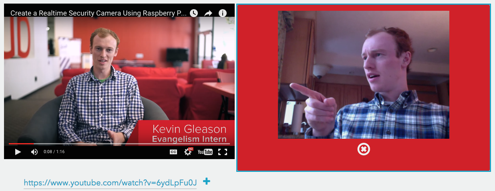
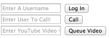
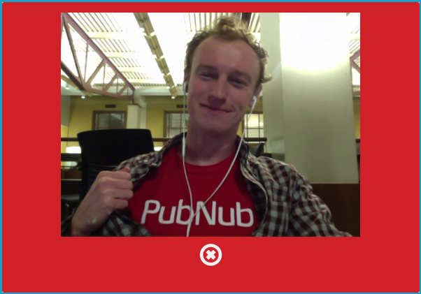
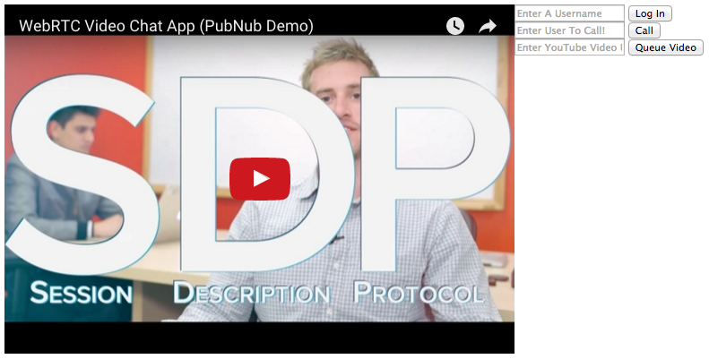

# WebRTC - YouTube Together



WebRTC is becoming widely adopted by large companies everywhere. If you don't know it already, WebRTC is a free, open-source project that provides simple APIs for creating Real-Time Communications (RTC) for browsers and mobile devices. It powers many modern video chatting services, even Chromecast uses it to broadcast your chrome tab to the TV screen. It makes streaming any content such as video, audio, or arbitrary data simple and _fast_. Today we will be building a video chat application that allows you to watch YouTube with a friend!

## WebRTC and PubNub Signaling

WebRTC is not a standalone API, it needs a signaling service to coordinate communication. Metadata needs to be sent between callers before a connection can be established. 

This metadata includes things such as:

- Session control messages to open and close connections
- Error messages
- Codecs/Codec settings, bandwidth and media types
- Keys to establish a secure connection
- Network data such as host IP and port

Once signaling has taken place, video/audio/data is streamed directly between clients, using WebRTC's `PeerConnection` API. This peer-to-peer direct connection allows you to stream high-bandwidth robust data, like video. In addition, we will be using `DataChannels` to stream messages through our RTC connection.

PubNub makes this signaling incredibly simple, and then gives you the power to do so much more with your WebRTC applications.

### Browser Compatibility

WebRTC is supported by popular browsers such as Chrome and Firefox, but there are many browsers on which certain features will not work. See a list of [supported browsers here](http://iswebrtcreadyyet.com/).

## Part 1: The Video Setup
Time to begin! First we will make the bare minimum WebRTC video chat. Then, in Part 2 we will be using WebRTC `DataChannels` and the YouTube API to create our application. The live demo for this tutorial [can be found here](http://kevingleason.me/WebRTC-TicTacToe/rtctactoe.html)!

### A Note on Testing and Debugging

If you try to open `file://<your-webrtc-project>` in your browser, you will likely run into Cross-Origin Resource Sharing (CORS) errors since the browser will block your requests to use video and microphone features. To test your code you have a few options. You can upload your files to a web server, like [Github Pages](https://pages.github.com/) if you prefer. In production, WebRTC requires HTTPS, so if you choose this method, visit your pages as `https://yourusername.github.io/project`. However, to keep development local, I recommend you setup a simple server using Python.

To so this, open your terminal and change directories into your current project and depending on your version of Python, run one of the following modules.

    cd <project-dir>

    # Python 2
    python -m SimpleHTTPServer <portNo>
    
    # Python 3
    python -m http.server <portNo>
    
For example, I run Python2.7 and the command I use is `python -m SimpleHTTPServer 8001`. Now I can go to `http://localhost:8001/index.html` to debug my app! Try making an `index.html` with anything in it and serve it on localhost before you continue.

### Step 1: The HTML5 Backbone

```html
<div id="player"></div>
<div style="float: left; width: 50%;">
    <div id="video-chat" hidden="true" style="margin-bottom: 10px;">
		<div id="vid-box"></div>
		<button onclick="end()">End Call</button>
    </div>
    
    <form name="loginForm" id="login" action="#" onsubmit="return login(this);">
        	<input type="text" name="username" id="username" placeholder="Enter A Username"/>            
			<input type="submit" name="login_submit" value="Log In">
    </form>

	<form name="callForm" id="call" action="#" onsubmit="return makeCall(this);">
        <input type="text" name="number" id="call" placeholder="Enter User To Call!"/>
        <input type="submit" value="Call">
	</form>
	
	<form name="cueForm" id="cue" action="#" onsubmit="return cueFromURL(this);">
        <input type="text" name="url" id="url" placeholder="Enter YouTube Video URL"/>
        <input type="submit" value="Queue Video">
	</form>
</div>
```

This should leave you with a very basic HTML backbone that looks something like this:



The `player` div will house our YouTube video, while `vid-box` will hold the video chat. We will use the forms to log-in, place calls, and enqueue videos. 

### Step 2: The JavaScript Imports

There are three libraries that you will need to include to make WebRTC operations much easier. The first thing you should include is [jQuery](https://jquery.com/) to make modifying DOM elements a breeze. Then, you will need the PubNub JavaScript SDK to facilitate the WebRTC signaling. Finally, include the PubNub WebRTC SDK which makes placing phone calls as simple as calling the `dial(number)` function.

```html
<script src="https://ajax.googleapis.com/ajax/libs/jquery/2.1.3/jquery.min.js"></script>
<script src="https://cdn.pubnub.com/pubnub.min.js"></script>
<script src="http://cdn.kevingleason.me/webrtc.js"></script>
```

We will include the YouTube API later. Now we are ready to write our calling functions for `login`, `makeCall`, and `end`!

### Part 3: Making and Receiving Calls

In order to start facilitating video calls, you will need a publish and subscribe key. To get your pub/sub keys, you’ll first need to [sign up for a PubNub account](http://www.pubnub.com/get-started/). Once you sign up, you can find your unique PubNub keys in the [PubNub Developer Dashboard](https://admin.pubnub.com). The free Sandbox tier should give you all the bandwidth you need to build and test your WebRTC Application.

```javascript
var video_hold = document.getElementById("video-chat");
var video_out  = document.getElementById("vid-box");
var user_name = "";

function login(form) {
	user_name = form.username.value || "Anonymous";
	var phone = window.phone = PHONE({
	    number        : user_name, // listen on username line else Anonymous
	    publish_key   : 'your-pub-key', // Your Pub Key
	    subscribe_key : 'your-sub-key', // Your Sub Key
	    datachannels  : true,
	});	
	phone.ready(function(){form.username.style.background="#55ff5b"; form.login_submit.hidden="true"; });
	phone.receive(function(session){
	    session.connected(function(session) { video_hold.hidden=false; video_out.appendChild(session.video); });
	    session.ended(function(session) { video_out.innerHTML=''; });
	});
	// Configure DataChannel
	return false;
}
```

You can see we use the username as the phone's number, and instantiate PubNub using your own publish and subscribe keys. The next function `phone.ready` allows you to define a callback for when the phone is ready to place a call. I simply change the username input's background to green, but you can tailor this to your needs.

The `phone.receive` function allows you to define a callback that takes a session for when a session (call) event occurs, whether that be a new call, a call hangup, or for losing service, you attach those event handlers to the sessions in `phone.receive`. 

I defined `session.connected` which is called after receiving a call when you are ready to begin talking. I simple appended the session's video element to our video div. 

Then, I define `session.ended` which is called after invoking `phone.hangup`. This is where you place end-call logic. I simply clear the video holder's innerHTML.

We now have a phone ready to receive a call, so it is time to create a `makeCall` function.

```javascript
function makeCall(form){
    if (!window.phone) alert("Login First!");
    else phone.dial(form.number.value);
    return false;
}
```

If `window.phone` is undefined, we cannot place a call. This will happen if the user did not log in first. If it is, we use the `phone.dial` function which takes a number and an optional list of servers to place a call.

Finally, to end a call or hangup, simply call the `phone.hangup` function and hide the video div.

```javascript
function end(){
	if (!window.phone) return;
	window.phone.hangup();
	video_hold.hidden = true;
}
```



You should now have a working video chatting application! When you are ready we can move on and implement the DataChannels.

## Part 2: DataChannels and YouTube

All that's left to do is set up the YouTube API, and then use WebRTC DataChannels to synchronize playback, so lets get going!

### Step 1: The YouTube IFrame API

We will start by filling the `player` div we created in Part 1 with a YouTube iframe. The following code is all based off the [YouTube API documentation](https://developers.google.com/youtube/iframe_api_reference).

```javascript
// This code loads the IFrame Player API code asynchronously. From YouTube API webpage.
var tag = document.createElement('script');
tag.src = "https://www.youtube.com/iframe_api";
var firstScriptTag = document.getElementsByTagName('script')[0];
firstScriptTag.parentNode.insertBefore(tag, firstScriptTag);

// This function creates an <iframe> (and YouTube player) after the API code downloads.
var player;
var vidId = "dQw4w9WgXcQ";  // The youtube Video ID for your starting video
function onYouTubeIframeAPIReady() {
	player = new YT.Player('player', {
	height: '390',
	width: '640',
	videoId: vidId, // Starting video ID
	events: {
		'onStateChange': onPlayerStateChange
		}
	});
}
```

This will look for a div with id `player` and place an iframe inside of it. You can change `vidId` to be the id of any YouTube video. `onPlayerStateChange` is a callback that we will have to implement shortly. 



### Step 2: DataChannels to Synchronize Playback

Currently, we can video chat, and we can watch YouTube. All we have to do is synchronize video playback. This includes play/pause, seeks, and what video is currently playing. We will accomplish all of this using the WebRTC `DataChannel` API. First, we need to define a few variables are used in the synchronization.

```javascript
var done = false; // Variable to tell if the video is done or not
var seek = false; // Used to decide if we seeked elsewhere in the video.
var VID_CUE = 6;  // We define a VID_CUE event type. Used in msg.data when queueing a video.
```

We will use these variables to implement the `onPlayerStateChange` function from the previous step. The YouTube API has built in `PlayerStates` which are attached to the `onPlayerStateChange` event. Here is a quick overview of some events and when they are triggered:

- `YT.PlayerState.PLAYING` when the play button is clicked
- `YT.PlayerState.PAUSED` when the pause button is clicked
- `YT.PlayerState.BUFFERING` when the video is buffering (seeks)

The PubNub WebRTC SDK makes the DataChannel API extremely easy to use. To _send data_, use the `phone.sendData`. Makes sense to me. Now, lets implement that callback, `onPlayerStateChange`.

```javascript
function onPlayerStateChange(event) {
	if (!window.phone) return; // No active video chat, return.
	event.username = user_name;
	switch (event.data) {
		case YT.PlayerState.PLAYING:
			if (done) return;
			window.phone.sendData(event);
			break;
		case YT.PlayerState.PAUSED:
			window.phone.sendData(event);
			break;
		case YT.PlayerState.BUFFERING: // If they seeked, dont send this.
			if (seek) seek = false;
			else window.phone.sendData(event);
	}
}
```

The YouTube API calls this function when the player's state changes. We attach a username to the event and then handle the state change as needed. The event comes through as JSON (e.g. `{data:PLAYING}`). Play/pause are handled by simply sending the event through the WebRTC `DataChannel` to the other user. When a user seeks, the `BUFFERING` callback will be triggered. If _you_ seek, the event gets sent through the data channel. Otherwise the other user sent you the buffering change, so we ignore it.

If you have followed any of my other WebRTC tutorials, you will notice that we use `phone.sendData` instead of `phone.send` here. `sendData` will send 1:1 messages through the WebRTC DataChannel API for immediate interactions, while `send` uses the 1:many PubNub streaming network. The PubNub WebRTC SDK allows us to seamlessly transition between both. 

__The PubNub streaming network is ideal for things like chat, while DataChannels are quicker for user interactions such as synchronization.__

### Step 3: Handling DataChannel Events

In step 2, we sent state changes through the data channel. Now, we have to handle the changes by creating an `onDataReceived` function, and then registering it as a callback using `phone.datachannel` in our login function.

```javascript
function onDataReceived(msg){
	if (msg.username==user_name) return; // Ignore what I sent.
	switch(msg.data){
		case YT.PlayerState.PLAYING:
			player.playVideo();
			break;
		case YT.PlayerState.PAUSED:
			player.pauseVideo();
			break;
		case YT.PlayerState.BUFFERING: // They are buffering, we must seek.
			seek = true;
			player.seekTo(msg.target.B.currentTime, true);
			break;
		case VID_CUE:
			player.cueVideoById(msg.video,0,"large");
			break;
	}
}
```

If the incoming data message is from yourself, return and ignore it. We handle the received data using several YouTube player functions. If the user we are chatting with sent a `PLAYING` change, we simply call `player.playVideo`. If we receive a `BUFFERING` change, the other user likely seemed. We handle this by calling `player.seekTo`. We need to set `seek=true` so that our `onStateChange` function does not send a `BUFFERING` message back, causing an infinite seek loop. We also check for `VID_CUE` events, which change the currently playing video. 

We will implement a cue function in step 4, we still need to register this data channel callback. At the end of your `login` function from Part 1, before you return false, register the callback as follows:

```javascript
function login(form) {
	// Setup phone
	// Ready and Receive Callbacks
	...
	phone.datachannel(onDataReceived);
	return false;
}
```

### Step 4: Adding Videos to the Queue

Take a deep breath, the hard part is over. In this final step we will implement a function to change the currently playing video. To change the currently playing video, we will use the YouTube function:


```javascript
player.cueVideoById(videoId:String, 
					startSeconds:Number,
					suggestedQuality:String):Void
```

When looking at a YouTube URL, for example `https://www.youtube.com/watch?v=dQw4w9WgXcQ`, the video ID is the final value `dQw4w9WgXcQ`. Our queue function will parse this off a url.

```javascript
function cueFromURL(form){
	if (!form.url.value) return false;
	var url = form.url.value;
	var video_id = url.split('v=')[1];
	var ampersandPosition = video_id.indexOf('&');
	if(ampersandPosition != -1) {
		video_id = video_id.substring(0, ampersandPosition);
	}
	player.cueVideoById(video_id,0,"large");
	if (!window.phone) return; // Send event if phone connected.
	var msg = {username:user_name, data:VID_CUE, video:video_id};
	window.phone.sendData(msg);
	return false;
}
```

If the field is empty, we ignore the click by returning false. We parse the ID by splitting at `v=` and the following `&`, or the end of the string if no ampersand is present. When we have the ID, we cue the video and send a message through the data channel to notify users of the new video. We create the JSON payload in the `msg` variable and send it with `phone.sendData`.

You made it. Time to relax by dialing a friend and watching a funny cat video. Now its up to you to dream up some new features for this app! Hope you enjoyed this WebRTC tutorial, see you next time.

### Want to learn more?

If you made it this far, you must. Here are some other resources PubNub offers on WebRTC:

- [WebRTC RealTime TictacToe](https://scotch.io/tutorials/learn-webrtc-build-a-real-time-tic-tac-toe)
- [PubNub Android WebRTC API](https://github.com/GleasonK/android-webrtc-api)
- [Android WebRTC Example](https://github.com/GleasonK/AndroidRTC/)
- [PubNub WebRTC SDK](https://github.com/stephenlb/webrtc-sdk)
- [What is WebRTC](http://www.pubnub.com/blog/what-is-webrtc/)

We will be putting out more information and tricks of using WebRTC in the coming weeks so stay tuned!

[LiveDemo]:https://kevingleason.me/WebRTC-YouTubeTogether/yourtc.html
[YouTube Ref]:https://developers.google.com/youtube/iframe_api_reference
